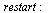

<!-- 
.. title: Análisis cinemático de un mecanismo plano usando Maple
.. slug: analisis-cinematico-de-un-mecanismo-plano-usando-maple
.. date: 2017-03-19 21:09:11 UTC-06:00
.. tags: mathjax,
.. category: 
.. link: 
.. description: 
.. type: text
-->

<table>
<tr>
<td valign="top" align="center"><strong>&gt; </strong></td>
<td valign="top"></td>
</tr>
</table>&nbsp;

<table>
<tr>
<td valign="top" align="center"><strong>&gt; </strong></td>
<td valign="top"></td>
</tr>
</table>&nbsp;

<table width='100%'>
<tr>
<td valign="top" align="center"></td>
<td width='5%' align='center'>(1)</td>
</tr>
</table>&nbsp;

<table>
<tr>
<td valign="top" align="center"><strong>&gt; </strong></td>
<td valign="top"></td>
</tr>
</table>&nbsp;

<table width='100%'>
<tr>
<td valign="top" align="center"></td>
<td width='5%' align='center'>(2)</td>
</tr>
</table>&nbsp;

<table>
<tr>
<td valign="top" align="center"><strong>&gt; </strong></td>
<td valign="top"></td>
</tr>
</table>&nbsp;
